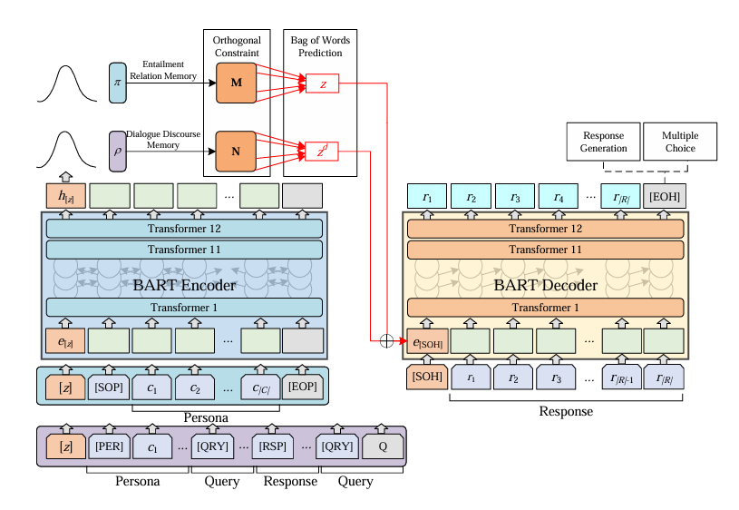

# 🎯 Objective
The goal of this project is to build a persona-consistent chatbot that can maintain coherent and logical conversations by understanding the relationship between user inputs (premises) and chatbot responses (hypotheses). Inspired by the research paper "Learning to Memorize Entailment and Discourse Relations for Persona-Consistent Dialogues", this chatbot integrates Natural Language Inference (NLI) and discourse-aware reasoning to ensure each response aligns with the assigned persona and dialogue history.



## For CPU installation
```bash
## Install for Cpu only for testing in local ( samll size )
pip install torch --no-cache-dir --index-url https://download.pytorch.org/whl/cpu 

##Looking in indexes: https://download.pytorch.org/whl/cpu

pip install --no-cache-dir --force-reinstall numpy
pip install transformers
```

